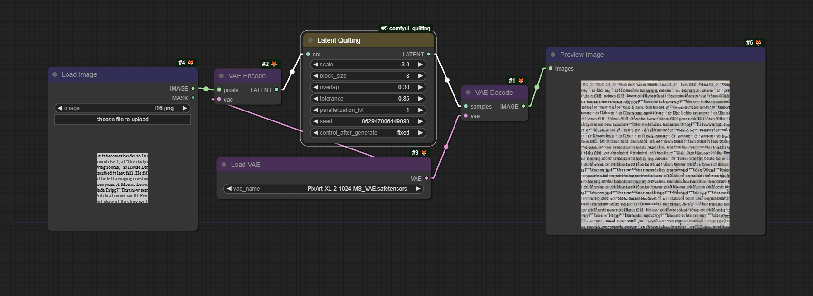

# comfyui_quilting
Image and latent quilting nodes for [ComfyUI](https://github.com/comfyanonymous/ComfyUI).

### Image quilting example workflow

### Latent quilting example workflow

## Quilting Arguments

### scale
The output will have the source dimensions scaled by this amount. 

###  block_size
The size of the blocks is given in pixels for images; for latent images, use the number of pixels divided by 8 instead.

All image nodes allow for the block size to be defined automatically by setting **block_size** to values within the range **[-1, 2]**. The meanings of these values are as follows:

* -1: Uses the same logic as the **Guess Nice Block Size** node with the option **simple_and_fast** enabled, which uses a quick estimation.
* 0: Similar to the previous option, but **simple_and_fast** is disabled. 
* 1: Sets block size to 1/3 of the texture shortest edge length. A likely decent block size without needing to readjust the value when changing texture and not prone to algorithmic swings. 
* 2: Sets block size to 3/4 of the texture shortest edge length. If you need a quick generation or handle a considerably large portion of the texture when running a seamless node but don't want to set the block size manually.  

When a batch of images is provided, a separate block size guess is computed for each image individually.

Note that the guessed block sizes are recalculated each time and are not stored for future executions. If caching is important, you can use the **Guess Nice Block Size** node instead. However, be aware that this node will not calculate individual block sizes for each image in a batch; it will only inspect the first image.

### overlap
Given as a percentage, indicates the portion of the block that overlaps with the next block when stitching.

### tolerance
When stitching, tolerance defines the margin of acceptable patches.

- Lower tolerance: Selects sets of patches that better fit their neighborhood but may result in too much repetition.
- Higher tolerance: Avoids repetition but may generate some not-so-seamless transitions between patches.

A tolerance of 1 allows for the selection of patches with an error value up to twice the minimum error, where the minimum error is defined as the error of the most seamless patch. The selection among these patches is random.

### parallelization_lvl (Parallelization Level)
Controls the level of parallel processing during the generation.

* 0: Runs the algorithm sequentially (no parallelization).

* 1: Segments the generation into 4 quadrants, which are generated in parallel.

* 2 or more: Generally not recommended for most use cases as it can be slower than using a lower parallelization level. Consider this setting for larger generations and patches, and also account for the available CPU cores.

    When using a parallelization level of 2 or more:

    * Each quadrant's process will use a number of subprocesses equal to the parallelization level to generate that quadrant. 
    * The generation is done via cascading rows, where a row can only be generated to the same extent as the previous row. Consequently, a process may stay idle waiting for the previous row generation to advance. 

**Changing the parallelization level will affect the output!**

The sides where the overlap occurs differ for each quadrant, 
so it is not possible to reproduce the same result as the sequential algorithm. Higher levels of parallelization do not suffer from this problem conceptually, 
however the current implementation won't generate the same output.

### version

The version parameter affects only patch search and selection. For better performance, it is recommended to use a version above zero. The behaviors for each version are as follows:

* 0: Uses the original jena2020 implementation with numpy, calculating the mean of squared differences for each overlapping section and summing these results. This option provides the same results as version 1.0.0.

* 1: Similar to version 0 but utilizes OpenCV's matchTemplate with the TM_SQDIFF option, improving performance.

* 2: Builds on version 1 by using the maximum error of all overlapping sections to minimize worst-case edges. For image nodes, the CIELAB color space is used instead of RGB.

* 3: Employs matchTemplate with the TM_CCOEFF_NORMED option. The final error is 1 minus the minimum value from all overlapping sections, also minimizing worst-case edges.

## Make Seamless Nodes

### Additional Arguments

Seamless nodes have the following additional arguments:

* **lookup**: the texture from which the patches are obtained; if no lookup is provided, the src is used instead.
* **ori**: the orientation in which to make the texture seamless: `H` for horizontally; `V` for vertically; `H & V` for both.

### Make Seamless SP vs MP

Make Seamless Nodes come in two types: Single Patch (SP) and Multi Patch (MP).

Single Patch (SP):
* Faster than MP if no lookup texture is generated, albeit rarely with acceptable results.
* May give a more cohesive result in specific cases (e.g., vertically patching a journal without breaking words).

Multi Patch (MP):
* More likely to produce good results without a lookup texture compared to SP.
* Handles intricate textures better due to its more granular approach.
* Allows tweaking variation levels via tolerance adjustments quilting nodes.

 - - Image of SP and MP, respectively - - 

  

Both SP and MP make textures seamless by patching vertically first, then horizontally. The horizontal seam resulting from the second operation is patched with two square patches.

 - - Image of the horizontal seam patching - - 

  
