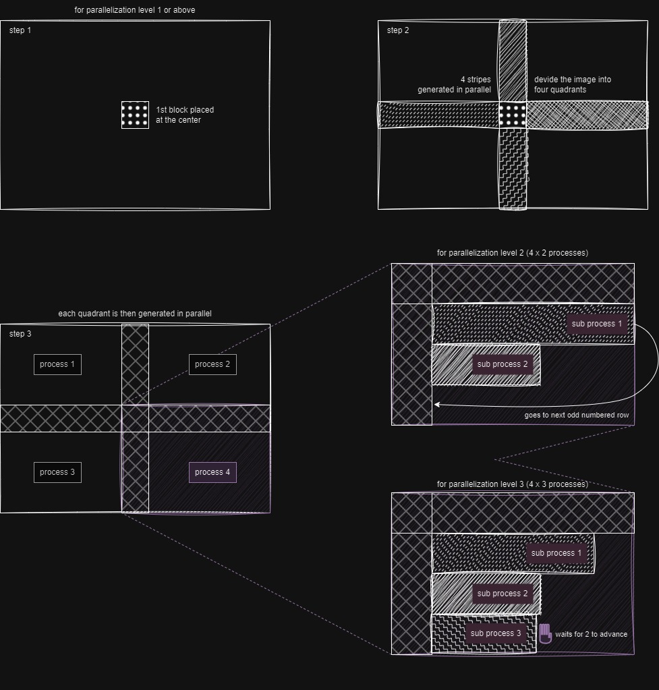

# comfyui_quilting

Image and latent quilting nodes for [ComfyUI](https://github.com/comfyanonymous/ComfyUI).

This project utilizes the texture synthesis technique from the paper: [Alexei A. Efros and William T. Freeman. 2001. Image quilting for texture synthesis and transfer.](https://doi.org/10.1145/383259.383296)

Currently, no texture transfer node is implemented. However, other potential applications and complements to the algorithm were explored, namely:

* Making textures seamless using quilting.
* Automatically guessing an appropriate block size.
* Blending into a patch instead of using a binary mask.

For better context, see the examples below and the remaining workflows in the [worklows folder](workflows/)

 - - Example Workflows - -  

### Image quilting example workflow

### Vertically seamless texture example workflow

## How to use

<h3  style="display:inline-block"> Making sense of the nodes' inputs </h3>

_________________________
###  block_size

**The size of the blocks is given in pixels for images; for latent images, use the number of pixels divided by 8 instead.**

Block size impacts both the synthesis time and the seamlessness of the generated texture.

Larger blocks can speed up the generation process because fewer blocks are required to cover the same area, and the patch search area is reduced. However, achieving seamless generation involves careful consideration of block size.

If the block size is too small, it may struggle to adequately cover different patterns, leading to issues with texture continuity. Conversely, if the block size is too large, there may not be enough addressable area to properly cover an entire pattern or its variations, potentially resulting in noticeable seams or repetitions.

**To address this challenge, all image nodes allow for the block size to be defined automatically by setting block_size to values within the range of [-1, 2]. The meanings of these values are as follows:**

* -1: Uses the same logic as the **Guess Nice Block Size** node with the option **simple_and_fast** enabled, which uses a quick estimation.
* 0: Similar to the previous option, but **simple_and_fast** is disabled. 
* 1: Sets block size to 1/3 of the texture shortest edge length. A likely decent block size without needing to readjust the value when changing texture and not prone to algorithmic swings. 
* 2: Sets block size to 3/4 of the texture shortest edge length. If you need a quick generation or handle a considerably large portion of the texture when running a seamless node but don't want to set the block size manually.  

When a batch of images is provided, a separate block size guess is computed for each image individually.

Note that the guessed block sizes are recalculated each time and are not stored for future executions. If caching is important, you can use the **Guess Nice Block Size** node instead. However, be aware that this node will not calculate individual block sizes for each image in a batch; it will only inspect the first image.

_________________________
### overlap

Given as a percentage, indicates the portion of the block that overlaps with the next block when stitching.

_________________________
### tolerance

When stitching, tolerance defines the margin of acceptable patches.

- Lower tolerance: Selects sets of patches that better fit their neighborhood but may result in too much repetition.
- Higher tolerance: Avoids repetition but may generate some not-so-seamless transitions between patches.

A tolerance of 1 allows for the selection of patches with an error value up to twice the minimum error, where the minimum error is defined as the error of the most seamless patch. The selection among these patches is random.

_________________________
### parallelization_lvl (Parallelization Level)
Controls the level of parallel processing during the generation.

* 0: Runs the algorithm sequentially (no parallelization).

* 1: Segments the generation into 4 quadrants, which are generated in parallel.

* 2 or more: Generally not recommended for most use cases as it can be slower than using a lower parallelization level. Consider this setting for larger generations and patches, and also account for the available CPU cores.

    When using a parallelization level of 2 or more:

    * Each quadrant's process will use a number of subprocesses equal to the parallelization level to generate that quadrant. 
    * The generation is done via cascading rows, where a row can only be generated to the same extent as the previous row. Consequently, a process may stay idle waiting for the previous row generation to advance. 

 - - Parallel generation diagram - - 

  

**Changing the parallelization level will affect the output!**

The sides where the overlap occurs differ for each quadrant, 
so it is not possible to reproduce the same result as the sequential algorithm. Higher levels of parallelization do not suffer from this problem conceptually, 
however the current implementation won't generate the same output.

_________________________
### version

The version parameter affects only patch search and selection. For better performance, it is recommended to use a version above zero. The behaviors for each version are as follows:

* 0: Uses the original jena2020 implementation with numpy, calculating the mean of squared differences for each overlapping section and summing these results. This option provides the same results as version 1.0.0.

* 1: Similar to version 0 but utilizes OpenCV's matchTemplate with the TM_SQDIFF option, improving performance.

* 2: Builds on version 1 by using the maximum error of all overlapping sections to minimize worst-case edges. For image nodes, the CIELAB color space is used instead of RGB.

* 3: Employs matchTemplate with the TM_CCOEFF_NORMED option. The final error is 1 minus the minimum value from all overlapping sections, also minimizing worst-case edges.

_________________________
### blend_into_patch

If enabled, the transition between an existing texture and a patch is made gradual.

This is done using a combination of three masks:

* Blurred Min-Cut Mask: similar to the original minimum cut mask but slightly blurred to avoid a harsh transition. The blurring is minimal to prevent the transition from extending to the margins, keeping block edges unnoticeable.

* Distance Transform Mask: this mask scales the transition area based on the size of patches in the minimum cut mask. Larger patches have longer transition areas, ensuring a smoother blend.

* Edge-Enhanced Mask: to prevent low values at the corners, which can make the patch noticeable, this mask combines the first two masks. It prioritizes the first mask near the patch edges to keep the corners unnoticeable.

<h3  style="display:inline-block"> Seamless nodes </h3>

_________________________
### Additional Inputs

Seamless nodes have the following additional inputs:

* **lookup**: the texture from which the patches are obtained; if no lookup is provided, the src is used instead.
* **ori**: the orientation in which to make the texture seamless: `H` for horizontally; `V` for vertically; `H & V` for both.

_________________________
### Make Seamless SP vs MP

Make Seamless Nodes come in two types: Single Patch (SP) and Multi Patch (MP).

Single Patch (SP):
* Faster than MP if no lookup texture is generated, albeit rarely with acceptable results.
* May give a more cohesive result in specific cases (e.g., vertically patching a journal without breaking words).

Multi Patch (MP):
* More likely to produce good results without a lookup texture compared to SP.
* Handles intricate textures better due to its more granular approach.
* Allows adjusting pattern variation through the tolerance setting, similar to quilting nodes.

 - - Image of SP and MP, respectively - - 

  

Both SP and MP make textures seamless by patching vertically first, then horizontally. The horizontal seam resulting from the second operation is patched with two square patches.

 - - Image of the horizontal seam patching - - 

  

<h3  style="display:inline-block"> List vs Batch processing </h3>

Items in a list are processed one at a time, while items in a batch are processed in parallel.

When using batches, the generation will still run with the configured level of parallelization, regardless of the batch size. Be mindful of this to avoid running too many processes simultaneously.

<h3  style="display:inline-block"> Block size estimation </h3>

The block size for generation can be estimated using the **Guess Quilting Block Size** node, or using a block size within the reserved range [-1, 0] as described in [Making sense of the nodes' inputs > block_size](#block_size). However, keep in mind that the automatically determined block size may not always be suitable for the texture, and that block size also affects generation time. A smaller block size may significantly increase the time required for generation.

<u>Enabling **simple_and_fast** is advised for medium and large textures</u>, and it will skip the *SIFT analysis* described below.

The heuristic for guessing the block size works as follows:

1. **Frequency Spectrum Analysis**: 
The texture's frequency spectrum is analyzed to identify points with high magnitudes. 
Only the maximum x or y components are retained, ignoring the direction of patterns. The selected high magnitudes are then adjusted and normalized so that their sum equals one.

2. **Optional SIFT Analysis**: 
This step is optional and slower, recommended only for small textures. 
SIFT descriptors are retrieved and clustered by size. The minimum distance  (considering only the maximum of the x and y components) between elements in each cluster is calculated. 
The average descriptor size and the minimum distance within each cluster are weighted by an estimate of the area coverage in the texture. As in step 1, the weights are adjusted and normalized to sum to one.

3. **Compute Fitness**: 
The sizes from steps 1 and 2 are used to identify numbers that are closest to their multiples, prioritizing those with larger weights.
The search is constrained constrained as to do not exceed half the size of the smallest texture dimension or the largest size obtained in the data. 
If step 2 is used, the total weight sum is 2, giving equal importance to both approaches.

4. **Final Selection**: From the list of candidate sizes obtained in step 3, the largest size (not necessarily the one with the best fitness) is selected as the block size.

## TODO

* instalation & troubleshooting & pyastar2d 